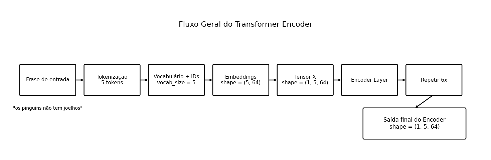
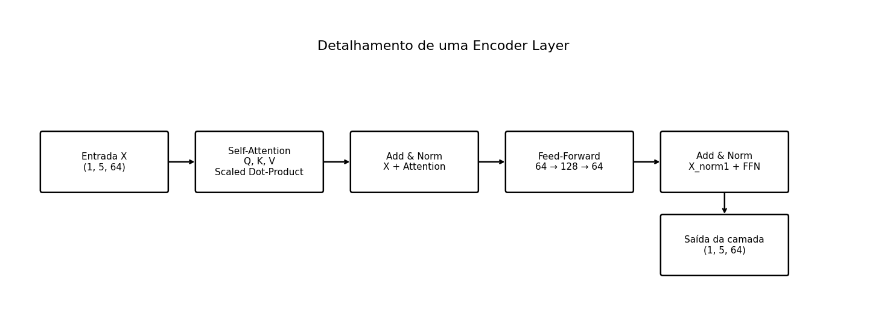

# Implementação de um Transformer Encoder com Python, NumPy e pandas

## Descrição

Este projeto implementa, de forma didática e manual, o fluxo principal de um **Transformer Encoder**, conforme a arquitetura apresentada no artigo [*Attention Is All You Need*](https://arxiv.org/abs/1706.03762).

A implementação foi construída utilizando apenas:

- Python
- NumPy
- pandas
- matplotlib

O objetivo é compreender, passo a passo, como os dados percorrem as camadas do encoder, desde a preparação da frase de entrada até a geração da saída final contextualizada.

---

## Objetivo do laboratório

O objetivo deste laboratório é implementar os componentes principais de um **Transformer Encoder**, incluindo:

- preparação da entrada textual
- criação de embeddings
- cálculo de **Q**, **K** e **V**
- mecanismo de **self-attention**
- conexão residual
- **layer normalization**
- **feed-forward network (FFN)**
- empilhamento de **6 camadas do encoder**

Além disso, o projeto gera diagramas visuais do fluxo geral do encoder e do detalhamento de uma camada.

---

## Frase utilizada no experimento

```
os pinguins não tem joelhos
```

---

## Estrutura do projeto

```
implementando-encoder/
├── main.py
├── config.py
├── attention.py
├── math_utils.py
├── data_utils.py
├── feed_forward.py
├── encoder.py
├── visualization.py
├── requirements.txt
├── outputs/
├── img/
└── README.md
```

### Descrição dos arquivos

- **main.py**  
  Arquivo principal do projeto. Executa o fluxo completo do laboratório, desde a preparação da entrada até a geração da saída final do encoder e dos diagramas.

- **config.py**  
  Armazena as configurações e hiperparâmetros do projeto, como dimensão dos embeddings, número de camadas do encoder, dimensão da FFN e demais constantes utilizadas na execução.

- **attention.py**  
  Implementa o mecanismo de self-attention, incluindo a projeção linear para **Q**, **K** e **V**, o cálculo dos scores e a atenção escalada.

- **math_utils.py**  
  Reúne funções matemáticas auxiliares utilizadas no projeto, como `softmax`, `relu` e `layer_norm`.

- **data_utils.py**  
  Contém funções responsáveis pela preparação dos dados, como tokenização, criação do vocabulário, codificação dos tokens em IDs, geração dos embeddings e montagem do tensor de entrada.

- **feed_forward.py**  
  Implementa a Feed-Forward Network (FFN) do encoder, composta por duas transformações lineares e uma ativação ReLU intermediária.

- **encoder.py**  
  Implementa uma camada completa do Transformer Encoder e também a pilha com as 6 camadas do encoder.

- **visualization.py**  
  Gera os diagramas visuais do projeto, incluindo o fluxo geral do encoder e o detalhamento interno de uma encoder layer.

- **requirements.txt**  
  Lista as dependências necessárias para executar o projeto.

- **outputs/**  
  Pasta destinada ao armazenamento dos arquivos gerados pelo programa, como diagramas e demais saídas produzidas durante a execução.

- **img/**  
  Pasta reservada para imagens utilizadas na documentação, no relatório ou em materiais de apoio do projeto.

- **README.md**  
  Arquivo de documentação principal do projeto, contendo descrição, objetivo, estrutura, instruções de execução e observações sobre a implementação.

---

## Requisitos

Antes de executar o projeto, instale as dependências abaixo.

```
python -m pip install numpy pandas matplotlib
```

---

## Como executar

No terminal, dentro da pasta do projeto, execute:

```
python3 main.py
```

Ou, dependendo do ambiente:

```
python main.py
```

---

## Etapas implementadas

O projeto executa as seguintes etapas:

1. **Preparação dos dados**
   - tokenização da frase
   - criação do vocabulário
   - mapeamento de palavras para IDs
   - criação da matriz de embeddings
   - criação do tensor de entrada `X`

2. **Self-Attention**
   - projeção linear para Q, K e V
   - cálculo da matriz de scores
   - escalonamento por `sqrt(d_k)`
   - aplicação de `softmax`
   - geração da saída da atenção

3. **Add & Norm após atenção**
   - soma residual entre entrada e saída da atenção
   - aplicação de `LayerNorm`

4. **Feed-Forward Network**
   - primeira transformação linear
   - ativação ReLU
   - segunda transformação linear

5. **Add & Norm após FFN**
   - soma residual entre entrada da FFN e saída da FFN
   - aplicação de `LayerNorm`

6. **Encoder completo**
   - empilhamento de 6 camadas do encoder
  

7. **Visualização**
   - geração do fluxo geral do encoder
   - geração do detalhamento de uma camada do encoder

---

## Shapes principais do projeto

Para a frase utilizada, os principais shapes obtidos são:

- **matriz de embeddings:** `(5, 64)`
- **embeddings da frase:** `(5, 64)`
- **tensor de entrada X:** `(1, 5, 64)`

Durante a self-attention:

- **Q:** `(1, 5, 64)`
- **K:** `(1, 5, 64)`
- **V:** `(1, 5, 64)`
- **scaled_scores:** `(1, 5, 5)`
- **attention_weights:** `(1, 5, 5)`
- **attention_output:** `(1, 5, 64)`

Saída final do encoder:

- **encoder_output:** `(1, 5, 64)`

---

## Fórmulas principais utilizadas

### Self-Attention


Attention(Q, K, V) = softmax((QK^T) / sqrt(d_k))V


### Feed-Forward Network

FFN(x) = max(0, xW1 + b1)W2 + b2

### Layer Normalization

LayerNorm(x) = (x - μ) / sqrt(σ² + ε)

---

## Observações

- Os pesos e embeddings são inicializados aleatoriamente.
- O projeto **não realiza treinamento**.
- O objetivo é compreender a arquitetura e o fluxo matemático do encoder.
- Como os pesos são aleatórios, os valores gerados servem para estudo estrutural e não para inferência real de linguagem natural.

---

## Referência principal

VASWANI, Ashish et al. **Attention Is All You Need**. 2017.

---

## Conclusão

A implementação permitiu compreender, de forma prática, as operações internas de um Transformer Encoder, incluindo o mecanismo de self-attention, as conexões residuais, a normalização em camada e a rede feed-forward. O projeto evidencia como os dados são transformados ao longo de 6 camadas do encoder, preservando o shape de entrada e refinando as representações vetoriais dos tokens.